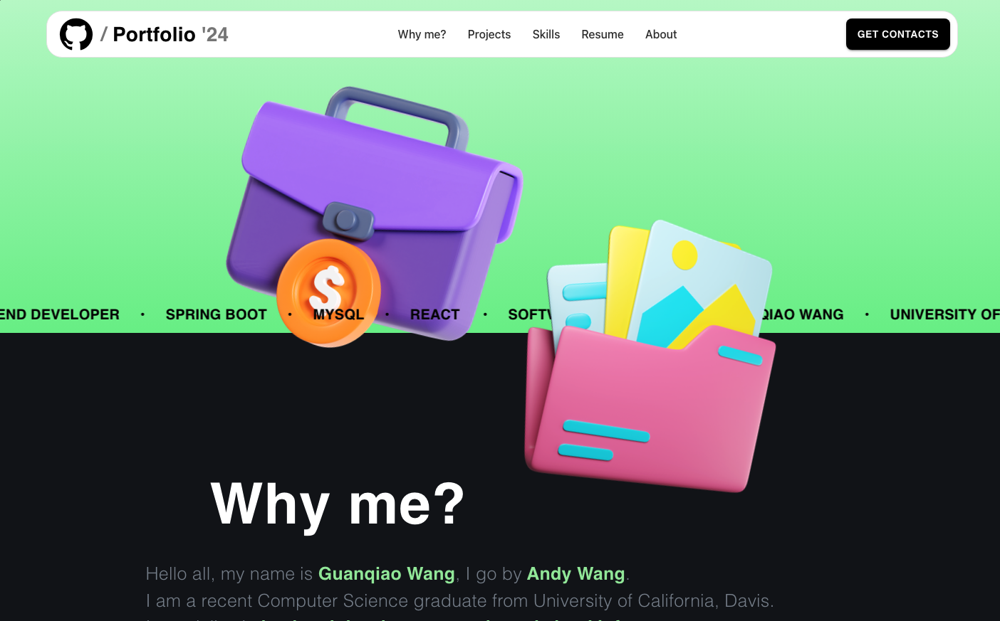

# My Portfolio

Welcome to the personal portfolio of **Guanqiao (Andy) Wang**. This portfolio showcases my projects, skills, and experience as a software engineer.




## Technologies

- **React** - A JavaScript library for building user interfaces.
- **Material-UI** - A popular React UI framework for building fast, responsive UIs.
- **React Router** - For managing navigation and routes within the app.
- **@react-pdf-viewer** - For viewing and rendering PDF resumes.
- **react-github-calendar** - Displays GitHub contributions.
- **JavaScript (ES6+)**
- **CSS and Material-UI's `sx` styling** - For custom styles and layout.
- **Vite** - For debug and package
- **CloudFlare** - Deployment

## Setup

### Prerequisites

- [Node.js](https://nodejs.org/) (version 14 or higher)
- [npm](https://www.npmjs.com/) or [yarn](https://yarnpkg.com/)

### Installation

1. Clone this repository to your local machine:

   ```bash
   git clone https://github.com/andygqw/MyPortfolio.git
   cd portfolio
   ```

2. Install dependencies:

   ```bash
   npm install
   ```

   or with yarn:

   ```bash
   yarn install
   ```

### Running the App

To run the app locally:

```bash
npm run dev
```

This will start the development server, and you can view the portfolio in your browser at `http://localhost:3000`.

### Building the App

To create a production build of the portfolio:

```bash
npm run build
```

### Deploying the App

To deploy to CloudFlare Pages:

1. Have CloudFlare cli and account set up
2. Bind Git repo to CloudFlare Page's out of the box CD
3. Push to remote

## Usage

The portfolio is designed for desktop browsers. If a user accesses the site from a screen width smaller than 1100px, a message will appear advising them to use a desktop browser.

### Customize the Content

To customize the content (e.g., skills, projects, contact info):

1. Modify the respective sections in the `src/components` directory:
   - `MainContent.jsx`: Update your personal introduction and overview.
   - `Projects.jsx`: Add or remove projects as necessary.
   - `Skills.jsx`: Update the skills section.
   - `ContactInfo.jsx`: Update contact details such as email, phone, GitHub, and LinkedIn.

2. Update `resume.pdf` in the `src/static/resume` directory with your latest resume.

## Contributing

If you'd like to contribute or suggest improvements:

1. Fork the repository.
2. Create a new branch (`git checkout -b feature-branch`).
3. Make your changes and commit them (`git commit -m 'Add new feature'`).
4. Push to the branch (`git push origin feature-branch`).
5. Open a pull request, and I'll review it!

## License

This project is licensed under the MIT License.
